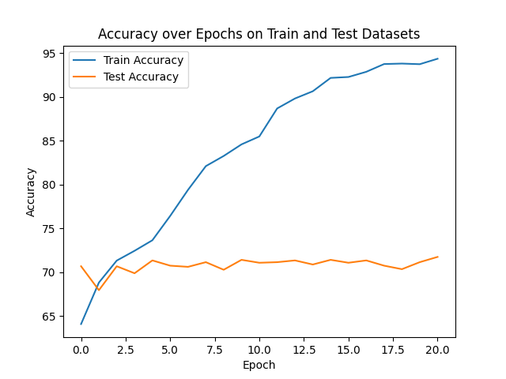
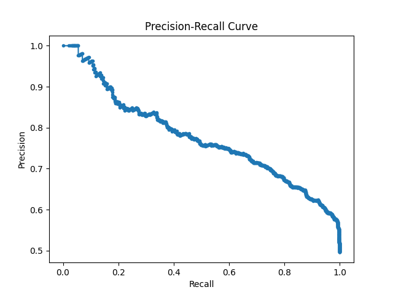
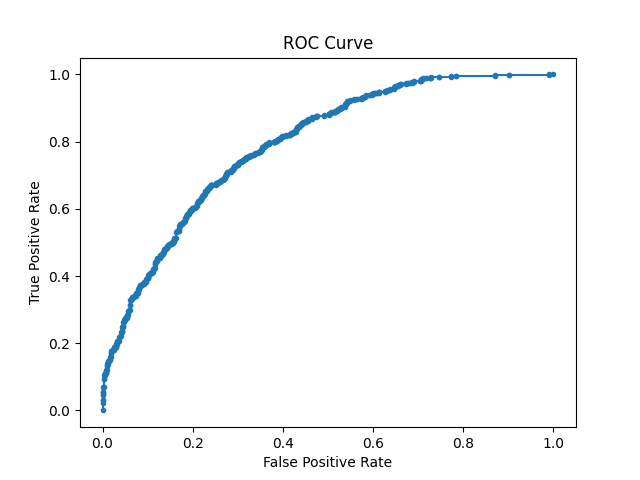

# Dcipher NLP Challenge - Mehmet Uluç Şahin

## Introduction
In this challenge I have implemented a Convolutional Neural Network (CNN) for classifying text data into either "Chemistry" or "Material Science" classes. I have used Python with PyTorch framework while utilizing pre-trained FastText model to obtain embeddings from pre-processed text data. After hyperparameter finetuning, the CNN model achieved 71.73% accuracy and AUC=0.799 score on test dataset.

## Model
The network is composed of 3 convolution layers that take word embeddings of titles as input and another 3 convolution layers that take word embeddings of abstracts as input. The layers for both title and abstract use kernel sizes of 3, 4 and 5. Outputs of these layers are concatenated and fed into fully connected layers for obtaining logits. Model architecture can be seen in the figure below:

## Data and Pre-Processing
There are 7494 data instances in the dataset. 50.6% of these instances belong to "Material Science" label while the rest belong to "Chemistry" label. Unbalanced datasets can cause neural networks to perform worse since it may create a bias. In our case, data is balanced and there is no need for processing to balance the dataset. Dataset is separated into train and test label-wise with the ratio of 0.8, that is, 80% from both "Chemistry" and "Material Science" are used as training data while the rest is used as test data.

We see many words with dashes, paranthesis and other special characters. Although it is a common practice to remove special characters, they have a special meaning in our dataset since they belong to names of word entities. For this reason, only "," and "." special characters are separated from words during preprocessing. All "Title" instances are padded to length of 50 and all "Abstract" instances are padded to length of 300. Finally, all words are converted to lowercase.

There is one data instance where "Abstract" part is empty. It is possible to remove this instance to prevent any problems that may arise. However, after padding all data instances to have same lengts, this instance of data is not problematic and "Title" part of it can still prove to be useful. 

In my tests, I did not see any improvement on test accuracy when the data is augmented.

## Word Embeddings
In contrast to other pre-trained models such as Word2Vec, FastText is able to generate word embeddings for words that are not available in the corpus. In the dataset, we see that there are many composite words that are not available in corpus. For this reason, pre-trained FastText model is used for obtaining 300 dimension word embeddings.

## Training
Training is conducted with following parameters:
Learning Rate = 0.000005
Weight Decay = 1e-5
Batch Size = 32
Convolution Layer Out Channels = 25
Convolution Layer Kernel Heights = [3, 4, 5]
Stride = 1
Padding = 0
Dropout Keep Probability = 0.6

## Results
Accuracy ratings on train and test dataset can be seen below. It is easy to notice the overfitting.

Precision-Recall curve can be seen in the following figure:

ROC Curve can be seen in the figure below. Achieved AUC score on test dataset is 0.799.

## Challenges and How to Improve Further
In my case, the model was overfitting easily. With the 0.8 train and test ratio, only 5995 data instances are available for training, which is not a big number when training neural networks. For this reason, I needed to keep the model very simple and avoid adding more layers. I used a low dropout keep probability (0.6) to further "simplify" the model for the same reason.

In this project I have used a word based CNN, however, other architectures such as text based CNNs, Recurrent Neural Networks (RNNs), or even Transformers can be tested. Similarly, different pre-trained word embedding models can be used or a new embedding model can be trained from stratch. 
